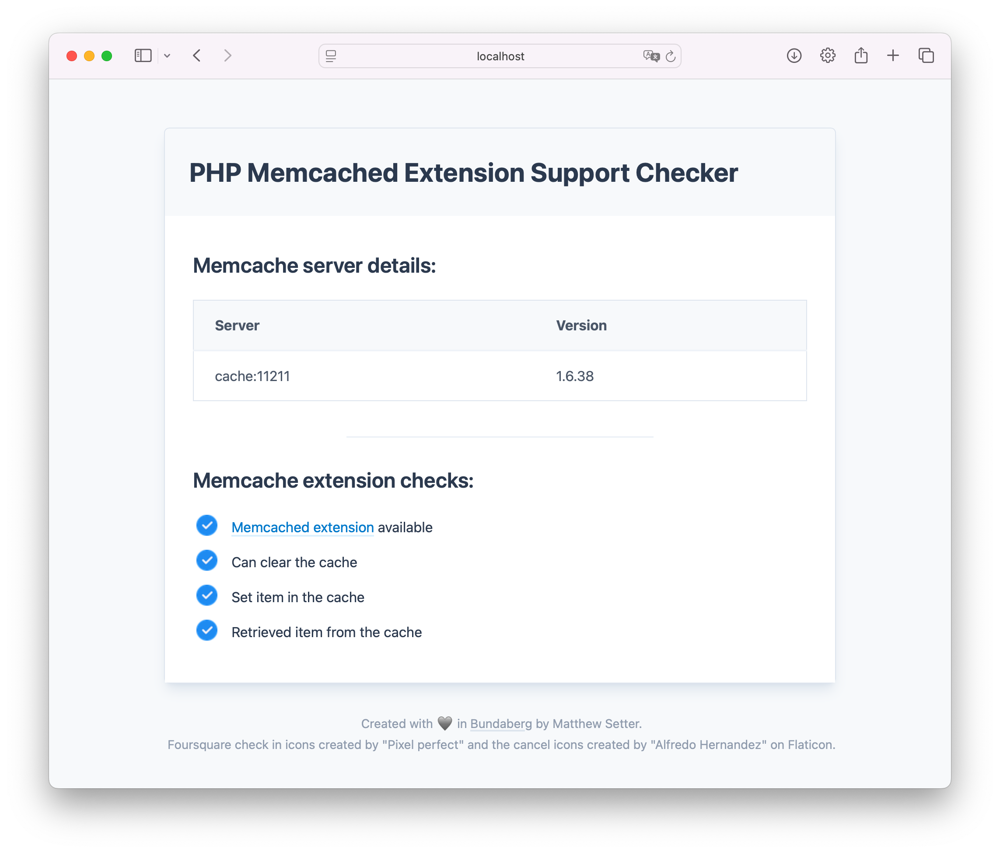

## PHP Memcache Demo Application

This is a small PHP application that performs basic interaction with one or more [Memcached][memcached] servers. 
It's backed by a minimalist [Docker Compose][docker-compose] configuration that sets up a two-container configuration. 
The first container runs Apache 2, handing off dynamic requests to PHP 8.4 using [Apache's MPM Prefork module][apache-mpm-prefork].
The second container runs Memcached, which PHP can then connect to.

Here's what the application looks like (in Safari on macOS):



## Prerequisites

To use the application, you'll need the following:

- [Docker Desktop][docker-desktop] or [Podman][podman]
- Your preferred code editor or IDE
- Your preferred web browser
- Some prior experience with containers would be helpful, though is not necessary

> [!TIP]
> If you're just getting started with Docker Compose, download a free copy of [Deploy With Docker Compose][deploy-with-docker-compose] which teaches you the essential knowledge you need to know, and provides a simple approach to deploying apps with Docker Compose.

## Usage

To use the project, clone [the repository][github-repository] locally, wherever you keep your PHP projects, then start the containers by running the following commands:

```bash
git clone git@github.com:settermjd/php-memcache-demo-app.git
cd php-memcache-demo-app
docker compose up
```

Then, when the application has started, open http://locahost:8080 in your preferred browser.

<!-- Links -->
[apache-mpm-prefork]: https://httpd.apache.org/docs/2.4/mod/prefork.html
[deploy-with-docker-compose]: https://deploywithdockercompose.com
[docker-compose]: https://docs.docker.com/compose/
[docker-desktop]: https://www.docker.com/products/docker-desktop/
[github-repository]: https://github.com/settermjd/php-memcache-demo-app
[memcached]: https://memcached.org
[podman]: https://podman.io
